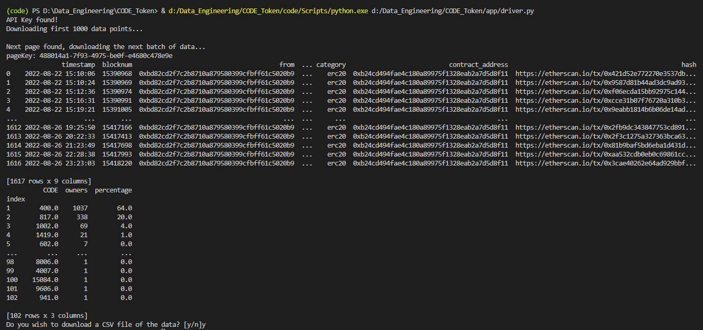

# $CODE Token Data Analysis

This is a simple project to track [Developer DAO](https://www.developerdao.com/) $CODE token [Airdrop](https://claim.developerdao.com/).



The project uses [Alchemy's](https://docs.alchemy.com/reference/alchemy-getassettransfers) `alchemy_getAssetTransfers` method to get data related to $CODE mint acitivity.

## Installation Steps
Clone the repository:

```
git clone https://github.com/tonykipkemboi/CODE_Token
```

Go into the directory.
```
cd CODE_Token
```

You have the option of running this app on the command line or opening it up in your favorite IDE (Integrated Development Environment).
Whichever option you choose, make sure to follow configure the below correctly.

**This next step is CRUCIAL, make sure to follow the instructions carefully**

- Create a `.env` file in the root directory `CODE_Token/.env` and create an empty variable `ALCHEMY_API_KEY = " "`
- Go to [Alchemy](https://www.alchemy.com/) and get an API Key
- Input the API Key into the variable `ALCHEMY_API_KEY = "your_api_key_goes_here"`
- Save the file `Ctrl + S`

Setup a `virtual environment` by running the following commands in your `windows terminal`:


- This will create a CODE_Token/env folder.
```
python -m venv env
```

- Activate venv with the following command (different variations depending on your OS(Operating System))
```
.\venv\Scripts\activate
```

- Add venv to your .gitignore file if not added already.

Install the dependencies required to run the program by running this command:

``` 
pip install -r requirements.txt
```

## Running the program on the Command Line 

Change directory into `app` folder to run the program as such;

- Change directory to app
```
cd app
```

Run the program;

```
python driver.py
```

After you're through and ready to close the terminal, `deactivate` the virtual environment by typing he following command;

``` 
deactivate
```
